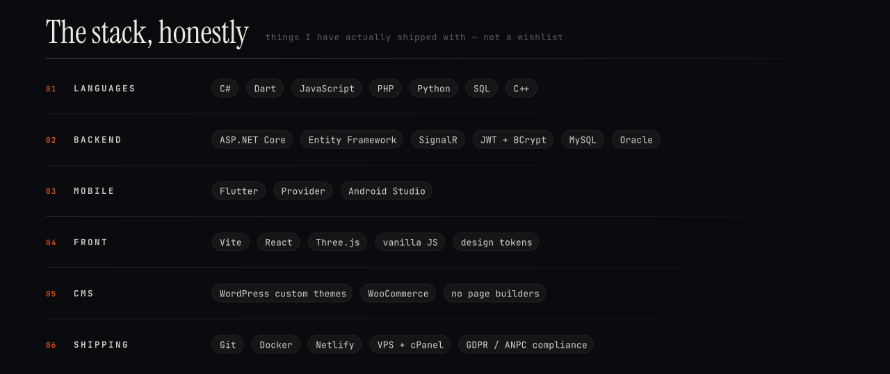
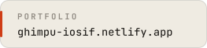
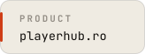

<picture>
  <source media="(prefers-color-scheme: dark)" srcset="assets/hero-dark.svg">
  <source media="(prefers-color-scheme: light)" srcset="assets/hero-light.svg">
  
</picture>

I write software for companies that are not on the internet yet.

Most of my work is unglamorous and very real: a firm in Galați has a phone number, a
logo on a van and nothing else. A while later it has a site, a catalogue, a cart, a
GDPR page and enquiries arriving in an inbox. Four of those are serving traffic right
now. In parallel I'm building **PlayerHub** — a Flutter + ASP.NET Core app for booking
sports pitches and organising matches, currently in pre-launch.

I'm also a second-year student at the Faculty of Economics and Business Administration,
"Dunărea de Jos" University of Galați — which turns out to be a good place to learn what
a business actually needs before you write a line of code for it.

 

## Live work

|  | Sector | What I built | |
|---|---|---|---|
| **PlayerHub** | Sports · marketplace | Flutter client, ASP.NET Core API (JWT + BCrypt, MySQL), match chat, in-app notifications, booking & subscriptions, owner analytics, marketing site | [playerhub.ro](https://playerhub.ro) |
| **AAC Almargal Smart** | Accounting | Hand-written WordPress theme, animated 3D hero, service catalogue, quote flow, GDPR | [contabilitateaac.ro](https://contabilitateaac.ro) |
| **Reggdany** | Residential construction | Hand-written theme, WooCommerce catalogue + checkout, account area, legal pages | [reggdany.ro](https://reggdany.ro) |
| **Opteam Construct** | Site preparation & drainage | Hand-written theme, service detail pages, cart, contact pipeline | [opteamconstruct.ro](https://opteamconstruct.ro) |
| **C&C Prevent** | Danube river freight | Hand-written theme, fleet & logistics pages, enquiry forms | [preventcargo.ro](https://preventcargo.ro) |

 

## Selected code

| Repository | What it is |
|---|---|
| [**battleship-multiplayer**](https://github.com/ghimpuiosif/battleship-multiplayer) | Real-time two-player Battleship over SignalR. One .NET 10 hub with matchmaking, two clients — WPF desktop and Blazor WebAssembly — talking to the same server. |
| [**playerhub-landing**](https://github.com/ghimpuiosif/playerhub-landing) | The PlayerHub marketing site. No framework, no build step — hand-written HTML/CSS/JS, a client-side include system, deep links that open the app if it is installed, and a contact form with a honeypot and a bot-timing check. |
| [**hero-3d**](https://github.com/ghimpuiosif/hero-3d) | A scroll-driven WebGL hero: React Three Fiber + Rapier physics + GSAP + Lenis. Built to find out how much motion a landing page can carry before it stops feeling fast. |
| [**playerhubFlutter**](https://github.com/ghimpuiosif/playerhubFlutter) | The PlayerHub codebase: ASP.NET Core API, the Flutter client, a .NET MAUI app and the Stitch UI design mockups, all in one repo. |
| [**iosif-ghimpu-portfolio**](https://github.com/ghimpuiosif/iosif-ghimpu-portfolio) | My own site. Vite, hand-built components, no template. |

 

<picture>
  <source media="(prefers-color-scheme: dark)" srcset="assets/stack-dark.svg">
  <source media="(prefers-color-scheme: light)" srcset="assets/stack-light.svg">
  
</picture>

 

## How I work

**No page builders.** Every client theme is written by hand, so the code can be handed
over, read and maintained by whoever comes next. It also loads in under a second on a
phone in a village with two bars of signal, which matters more than it sounds.

**Secrets never enter the repository.** Connection strings and signing keys live in
`user-secrets` and environment variables; keystores, `key.properties` and
`appsettings.Local.json` are ignored by default, and any repo that needs one ships an
example file instead of the real one. A public repo of mine should be safe to clone by
a stranger and useless to an attacker.

**Legal pages are part of the build, not an afterthought.** GDPR, cookie policy, terms
and the ANPC links go in on day one. In Romania that is not optional, and a client
should never have to find that out from a fine.

 

## Now

- Taking PlayerHub from pre-launch to the app stores
- Second year, Economics & Business Administration — Galați
- Open to freelance work and to a first real engineering role

 

[<picture><source media="(prefers-color-scheme: dark)" srcset="assets/chip-portfolio-dark.svg"></picture>](https://ghimpu-iosif.netlify.app)
[<picture><source media="(prefers-color-scheme: dark)" srcset="assets/chip-playerhub-dark.svg"></picture>](https://playerhub.ro)
[<picture><source media="(prefers-color-scheme: dark)" srcset="assets/chip-mail-dark.svg"></picture>](mailto:ghimpuiosif@gmail.com)
